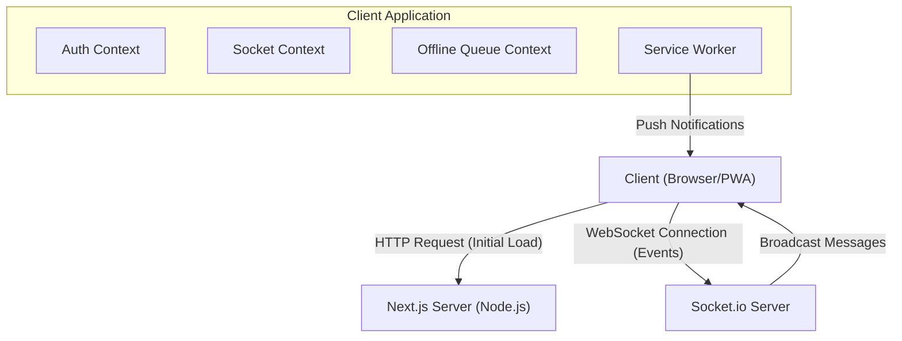

# 🏗️ Architecture & Tech Stack

## Stack Technique

Le projet est une **Progressive Web App (PWA)** construite avec des technologies modernes :

*   **Frontend Framework :** [Next.js 15](https://nextjs.org/) (App Router)
*   **UI Library :** [React 19](https://react.dev/)
*   **Styling :** [Tailwind CSS 4](https://tailwindcss.com/)
*   **Real-time Communication :** [Socket.io Client](https://socket.io/)
*   **Language :** TypeScript

## Architecture Globale

L'application suit une architecture client-serveur avec une connexion WebSocket persistante pour le temps réel.

## Structure du Projet

L'organisation des dossiers suit les conventions Next.js App Router :

*   **`/app`** : Pages et routes de l'application (Pages, Layouts).
*   **`/components`** : Composants React réutilisables (UI, Chat bubbles, Camera view).
*   **`/contexts`** : Gestion d'état global (Socket, Auth, Offline Queue).
*   **`/hooks`** : Custom hooks pour la logique métier (`useMessageHandling`, `useFileHandling`).
*   **`/public`** : Assets statiques et le fichier crucial `sw.js` (Service Worker).
*   **`/lib`** : Fonctions utilitaires et wrappers API (`api.ts`).
