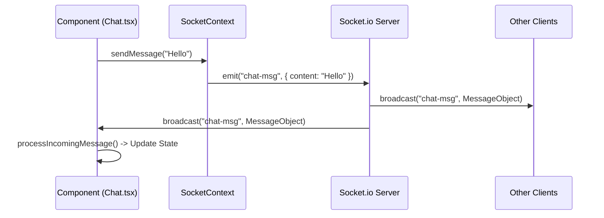

# ⚡ Messaging System Implementation

Le système de messagerie repose sur `Socket.io` pour la communication temps réel et une file d'attente locale pour la gestion du mode hors-ligne.

## Socket Context (`SocketContext.tsx`)

Toute la logique de connexion est encapsulée dans un React Context.
Le client s'initialise avec l'URL définie dans `SOCKET_URL`.

### Principaux Événements

| Event Name | Direction | Payload | Description |
| :--- | :--- | :--- | :--- |
| `chat-join-room` | Client -> Server | `{ pseudo, roomName }` | L'utilisateur rejoint une room spécifique. |
| `chat-msg` | Client -> Server | `{ content, roomName }` | Envoi d'un message texte ou image (base64). |
| `chat-msg` | Server -> Client | `Message` Object | Réception d'un message broadcasté aux membres de la room. |

## Flux de Données

## Gestion Hors-ligne (`OfflineQueueStringContext`)

L'application implémente une stratégie **Optimistic UI** avec support hors-ligne.

1.  **Détection :** Le hook `useOfflineQueue` surveille l'état de la connexion (`socket.connected`).
2.  **Mise en file :** Si le socket est déconnecté, les messages envoyés sont interceptés et stockés localement (State + LocalStorage éventuel).
3.  **Affichage :** Les messages en attente sont affichés avec un status `pending` (souvent grisés).
4.  **Reconnexion :** À la reconnexion du socket, la file d'attente est traitée et les messages sont envoyés chronologiquement.
